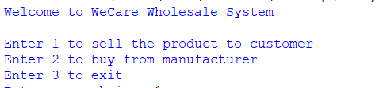

# WeCare Inventory Management System

## Overview

The WeCare Inventory Management System is a Python-based application developed as part of an academic coursework project. It is designed to help a skincare wholesale business manage its inventory efficiently by handling product sales, restocking, stock updates, and invoice generation.

The project uses a modular programming approach and file handling to store and manage inventory records.

---

## Features

- Display all available products
- Sell products with automatic stock updates
- Restock inventory
- Generate sales invoices
- Generate purchase (restocking) invoices
- Apply the "Buy 3 Get 1 Free" offer
- Handle multiple products in a single transaction
- Input validation and error handling
- Modular code structure

---

## Technologies Used

- Python 3
- File Handling
- Dictionaries
- Modular Programming
- Text File Storage

---

## Project Structure

```
WeCare-Inventory-Management-System/
│
├── main.py
├── operations.py
├── read.py
├── write.py
├── products.txt
├── README.md
├── documentation/
└── screenshots/
```

---

## How to Run

1. Download or clone this repository.
2. Open the project folder in your preferred Python IDE (such as VS Code or PyCharm).
3. Ensure Python 3 is installed.
4. Run the following command:

```bash
python main.py
```

5. Follow the on-screen menu to:
   - View products
   - Sell products
   - Restock products
   - Generate invoices

---

## Sample Functionalities

- Inventory Management
- Product Sales
- Product Restocking
- Automatic Invoice Generation
- Stock File Updates
- Buy 3 Get 1 Free Discount

---

## Learning Outcomes

This project helped strengthen my understanding of:

- Python programming
- Functions and modular programming
- File handling
- Exception handling
- Data structures (Dictionaries)
- User input validation
- Inventory management logic

---

## Screenshots

### Main Menu



### Product List


### Selling a Product


### Restocking a Product


### Sales Invoice


### Restock Invoice


---

## Future Improvements

- Graphical User Interface (GUI)
- Database integration (MySQL or SQLite)
- User authentication
- Search and filter products
- Sales reports and analytics

---

## Author

**Nitisha Nepal**
